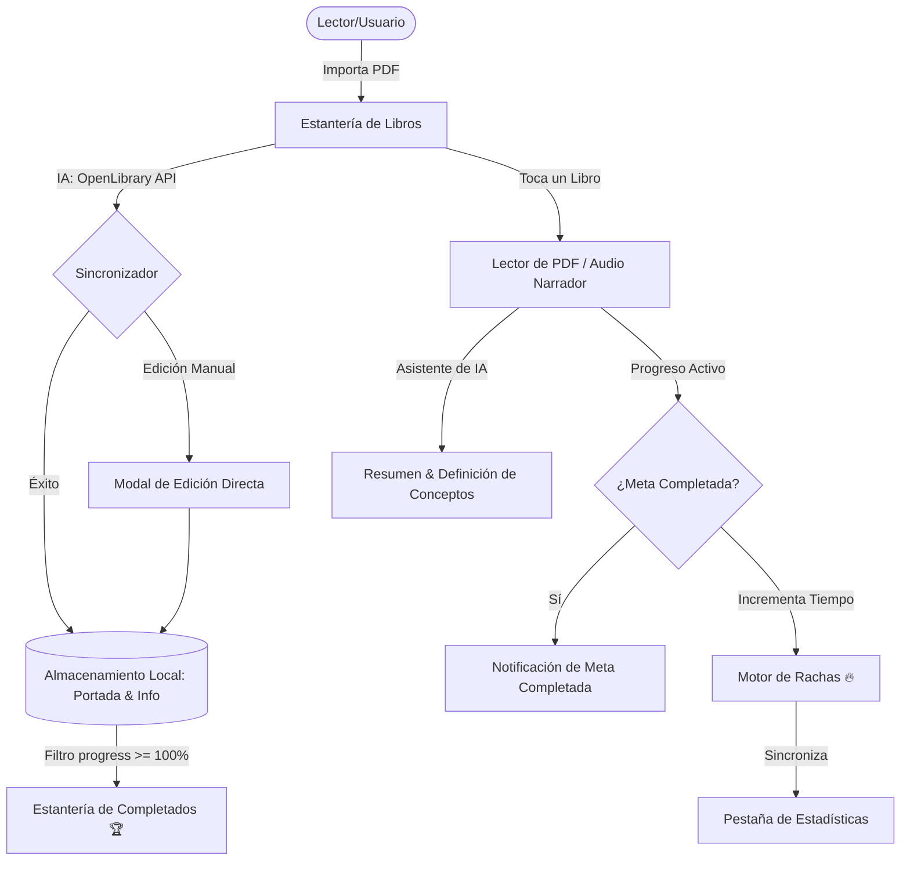

# 📚 Lector PDF Inteligente & Audiolibro

<p align="center">
  
  
  
  
  
</p>

Una aplicación móvil y web premium de lectura de PDFs y reproducción de audiolibros, potenciada con **Inteligencia Artificial** para explicaciones y resúmenes, y un sistema **gamificado de metas de lectura y rachas** para motivar el hábito diario.

---

## 🎨 Arquitectura de la Aplicación

El siguiente diagrama muestra el flujo interactivo de la app, desde la importación del PDF hasta la sincronización de datos con la IA y la base de datos persistente:



---

## ✨ Características Premium

### 📖 Lector Inmersivo de Alta Fidelidad
* **Modo Pantalla Completa**: Oculta todos los menús para una lectura limpia. Sal del modo inmersivo con solo hacer **dos clics (doble tap)** en la pantalla.
* **Tipografías de Libro Oficiales**: Cambia cíclicamente de fuente entre **Serif** (estilo papel clásico), **Sans** (minimalista y limpio), **Mono** (para códigos y técnicos) y **Fina** (estilo ultra delgado y elegante).
* **Temas Personalizados**: Ajusta la paleta de color al instante para cuidar tu vista:
  * **Claro**: Fondo brillante y texto nítido.
  * **Sepia**: Tonalidad cálida y relajante, ideal para luz de día moderada.
  * **Oscuro**: Fondo negro OLED para lecturas nocturnas sin fatiga.

### 🎧 Narrador de Audiolibro Inteligente
* **Texto a Voz (TTS)**: Motor de audio integrado que lee la página actual en voz alta usando la voz oficial de tu sistema operativo.
* **Controles de Reproducción**: Reproduce, pausa, avanza de página o retrocede de manera interactiva con un panel flotante.

### 🧠 Copiloto de Lectura con IA
* **Explicador de Conceptos**: Selecciona o ingresa una palabra que no entiendas y la IA te proporcionará una definición y contexto de inmediato sin salir de la lectura.
* **Resúmenes en Un Clic**: Obtén los puntos más importantes de tu página de lectura estructurados en un formato de viñetas muy legible.

### 🏆 Gamificación y Control de Rachas
* **Planificación Diaria**: Al abrir la app, selecciona tus minutos propuestos de lectura para hoy (5, 10, 15 o 30 minutos).
* **Insignia de Racha (`🔥`)**: Un indicador de fuego en tu biblioteca muestra tus días de racha acumulados de forma consecutiva.
* **Reinicios Inteligentes**: Si dejas de leer un día completo, la racha se reinicia a cero a la medianoche, fomentando la constancia diaria.
* **Pestaña Explorar**: Revisa tu progreso diario, porcentaje de la meta cumplida hoy y tus rachas acumuladas en un panel gráfico muy vistoso.
* **Libros Completados**: Sección dedicada que archiva de forma ordenada todos los libros que has leído al 100%.

### 🖼️ Portadas y Metadatos Automáticos
* **Buscador IA**: Al importar un libro, el motor detecta el título interno y busca en internet la carátula oficial y el autor del libro.
* **Editor de Portadas**: Permite cargar cualquier imagen de la galería de tu celular para usarla como carátula de tu PDF.
* **Spacious Form**: Un formulario de edición vertical con amplio espacio para escribir y ajustar los datos cómodamente.

---

## 🛠️ Stack Tecnológico

| Módulo | Tecnología / Dependencia |
| :--- | :--- |
| **Núcleo Móvil** | React Native (v0.86) & Expo (SDK 57) |
| **Enrutamiento** | Expo Router |
| **Persistencia** | `@react-native-async-storage/async-storage` |
| **Sistema de Archivos**| `expo-file-system` & `expo-document-picker` |
| **Audio Narración** | `expo-speech` |
| **Iconografía** | `lucide-react-native` |
| **Motor de Imágenes** | `expo-image` |

---

## 🚀 Guía de Instalación y Configuración

Sigue estos pasos para clonar el repositorio y levantar la aplicación en tu celular en menos de 5 minutos:

### 1. Clonar el repositorio
```bash
git clone https://github.com/manuelmoreno-dev/lector-pdf.git
cd lector-pdf
```

### 2. Instalar dependencias
```bash
npm install
```

### 3. Iniciar el entorno de desarrollo
```bash
npx expo start
```
* Escanea el **código QR** desde tu celular usando la aplicación de **Expo Go** para verlo en vivo al instante.
* Presiona **`r`** en la consola si deseas recargar el código en caliente.

---

## 📦 Compilación Cloud de tu APK (Expo EAS)

Para generar el archivo ejecutable `.apk` en los servidores en la nube de Expo de forma gratuita y sin configurar SDKs en tu computadora:

1. **Instala la CLI de EAS**:
   ```bash
   npm install -g eas-cli
   ```
2. **Inicia sesión en Expo**:
   ```bash
   eas login
   ```
3. **Ejecuta la compilación**:
   ```bash
   eas build --platform android --profile preview
   ```
* Al finalizar el proceso en la nube, la terminal te devolverá un **Código QR** y un enlace. Escanea el código con tu celular para descargar e instalar tu APK directamente.

---

## 📄 Licencia

Este proyecto está bajo la Licencia MIT. Consulta el archivo `LICENSE` para más detalles.
